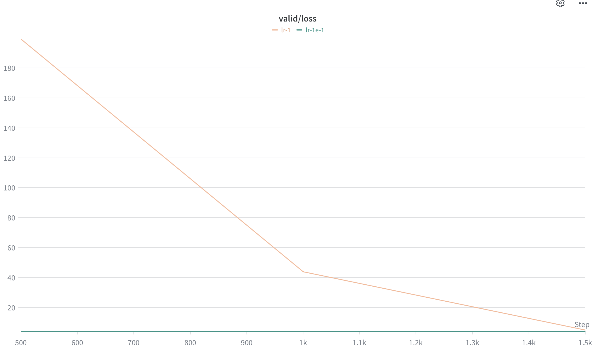
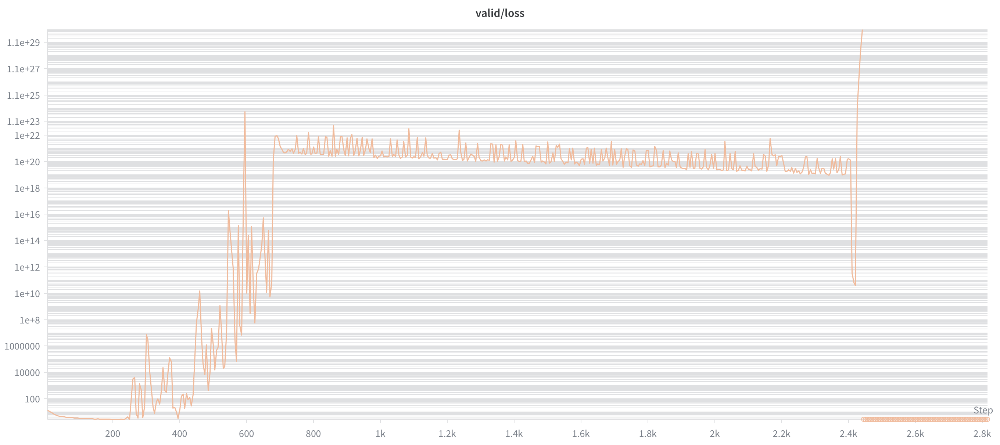
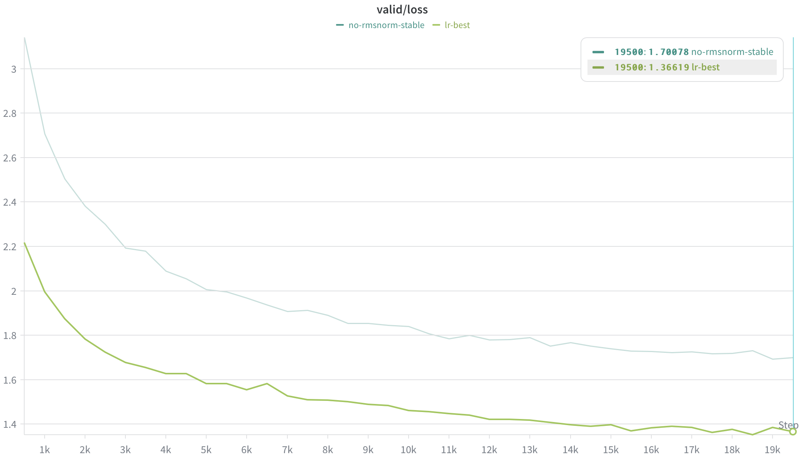
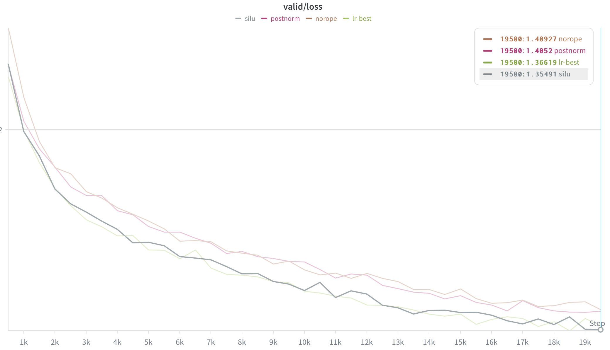
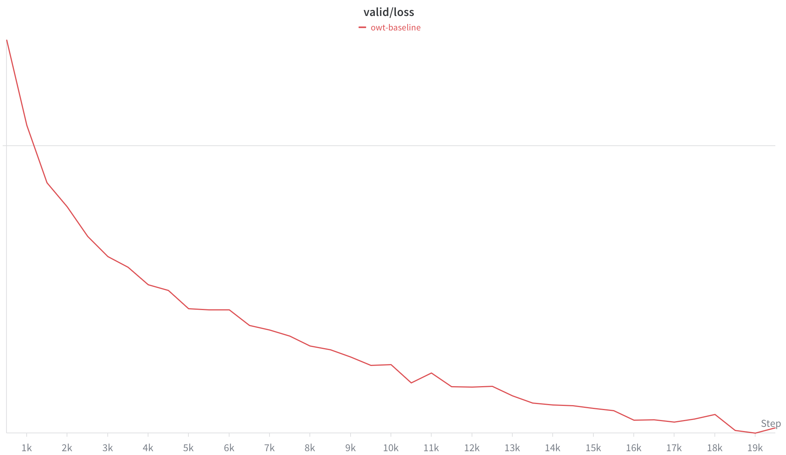

# 作业答案记录

## Problem (transformer_accounting)

GPT-2 XL 配置：
`vocab_size=50257`、`context_length=1024`、`num_layers N=48`、`d_model d=1600`、`num_heads h=25`、`d_ff f=4288`（≈ 8/3×1600 取 64 的整数倍）。

架构约定：无 bias；注意力 4 个 d×d 投影；SwiGLU FFN 3 个矩阵（W1,W3: f×d；W2: d×f）；RMSNorm 只有逐维 gain（d 个参数）；token embedding 与 LM head **不共享**。

记号：L 序列长度、d 模型维度、h 头数、dₖ=d/h 每头维度、f FFN 隐藏维、V 词表、N 层数。以下按 batch=1、单条长度 L 序列计算，最后乘 batch B 即可。

### (a) 可训练参数量与加载显存

| 组件 | 计算 | 参数量 |
|---|---|---|
| Token embedding | V·d = 50257×1600 | 80,411,200 |
| 每 block 注意力 (W_q,W_k,W_v,W_o) | 4·d² = 4×1600² | 10,240,000 |
| 每 block FFN (W1,W2,W3) | 3·d·f = 3×1600×4288 | 20,582,400 |
| 每 block 两个 RMSNorm | 2·d = 2×1600 | 3,200 |
| **单 block 合计** | | 30,825,600 |
| × N=48 层 | 30,825,600×48 | 1,479,628,800 |
| 最后 RMSNorm | d | 1,600 |
| LM head | V·d | 80,411,200 |

**答（参数量）**：

$$80{,}411{,}200 + 1{,}479{,}628{,}800 + 1{,}600 + 80{,}411{,}200 = \boxed{1{,}640{,}452{,}800 \approx 1.64\text{B}}$$

**答（显存，每参数 FP32 = 4 字节，仅加载权重）**：

$$1{,}640{,}452{,}800 × 4 = 6{,}561{,}811{,}200 \text{ bytes} \approx 6.56\text{ GB} = 6.11\text{ GiB}$$

（若改用半精度 fp16/bf16，每参数 2 字节，显存减半 ≈ 3.28 GB。注意这只是加载权重；训练时还要加梯度 1× 和 Adam 优化器状态 2×，实际显存远大于此。）

---

### (b) 前向 FLOPs 公式与 GPT-2 XL 总量

#### 通用公式（基础，后续 (c)(d) 都引用）

**唯一规则**：一个 `(m×n) @ (n×p)` 矩阵乘 = **2·m·n·p** FLOPs（输出每元素做 n 次乘 + n 次加 ≈ 2n 运算）。方法只有一条：**找出每个 matmul 的三个维度，套 2mnp**。

**忽略项**（非 matmul，逐元素操作）：`Embedding`（查表）、`RMSNorm`、RoPE 旋转、softmax、SwiGLU 的 SiLU 和逐元素乘——CS336 约定里直接忽略。真正花 FLOPs 的全是 `@` / `einsum`。

一个 TransformerBlock 的所有 matmul：

| matmul | 形状 (m,n,p) | FLOPs |
|---|---|---|
| Q / K / V 投影（各一次） | (L,d)·(d,d) | 3 × 2Ld² |
| QKᵀ 算分数 | h×[(L,dₖ)·(dₖ,L)] | 2·h·L²·dₖ = **2L²d** |
| 分数·V | h×[(L,L)·(L,dₖ)] | 2·h·L²·dₖ = **2L²d** |
| 输出投影 | (L,d)·(d,d) | 2Ld² |
| FFN W1 / W3 / W2 | (L,d)·(d,f)×2，(L,f)·(f,d)×1 | 3 × 2Ldf |

关键代换：QKᵀ / 分数·V 对 h 个头各做一次，是 `2·h·L²·dₖ`，而 `h·dₖ=d` 化简成 `2L²d`——这两项是注意力里**唯一随 L² 增长**的部分。

单 block 合计：$\underbrace{8Ld^2}_{\text{QKVO 投影}} + \underbrace{4L^2 d}_{\text{两个注意力 matmul}} + \underbrace{6Ldf}_{\text{FFN}}$

整个 TransformerLM（N 个 block + LM head `(L,d)·(d,V)`，embedding/RMSNorm ≈ 0）：

$$\boxed{\text{FLOPs} \approx N\big(8Ld^2 + 4L^2 d + 6Ldf\big) + 2LdV}$$

（batch B 整体乘 B。）

#### 代入 GPT-2 XL（N=48, d=1600, f=4288, V=50257, L=1024）

每层（×1 层）：

| 组件 | 公式 | 每层 FLOPs |
|---|---|---|
| QKVO 投影 | 8Ld² = 8×1024×1600² | 2.097×10¹⁰ |
| 注意力 L² 项 | 4L²d = 4×1024²×1600 | 6.711×10⁹ |
| FFN | 6Ldf = 6×1024×1600×4288 | 4.215×10¹⁰ |
| **每层合计** | | 6.984×10¹⁰ |

整模型（×N=48，加 LM head）：

| 组件 | 计算 | 总 FLOPs |
|---|---|---|
| QKVO 投影 | 2.097×10¹⁰ × 48 | 1.007×10¹² |
| 注意力 L² 项 | 6.711×10⁹ × 48 | 3.221×10¹¹ |
| FFN | 4.215×10¹⁰ × 48 | 2.023×10¹² |
| LM head | 2LdV = 2×1024×1600×50257 | 1.647×10¹¹ |

**答**：单条 1024-token 序列的前向总 FLOPs

$$\approx 3.517\times10^{12}\ \text{FLOPs}\ (\approx 3.52\ \text{TFLOPs})$$

（精确值 3,516,769,894,400；batch B 整体乘 B。）

---

### (c) 各部分占比

| 组件 | 总 FLOPs | 占比 |
|---|---|---|
| FFN | 2.023×10¹² | **57.5%** |
| QKVO 投影 | 1.007×10¹² | 28.6% |
| 注意力 L² 项（QKᵀ + 分数·V） | 3.221×10¹¹ | 9.2% |
| LM head | 1.647×10¹¹ | 4.7% |

**答**：**FFN 占大头（57.5%）**，其次是注意力的 QKVO 投影（28.6%）；二者都是"权重矩阵"类的线性项，合计约 86%。真正随 L² 增长的注意力 score/AV 项在 L=1024 时只占 **9.2%**，因为此时 `2d/L = 3200/1024 ≈ 3.1 > 1`，投影/FFN 仍主导（见 (d)）。LM head 虽然单矩阵参数量大（V·d），但只在最后算一次，仅占 4.7%。

---

### (d) 随 model size 变化的趋势

四档 GPT-2 超参（L=1024, V=50257, d_ff = 8/3·d 最近的 64 倍数）：

| 模型 | N | d | d_ff |
|---|---|---|---|
| small | 12 | 768 | 2048 |
| medium | 24 | 1024 | 2752 |
| large | 36 | 1280 | 3392 |
| XL | 48 | 1600 | 4288 |

各组件绝对 FLOPs（单条 1024-token 序列前向）：

| 模型 | QKVO 投影 | 注意力 L² 项 | FFN | LM head | 总 FLOPs |
|---|---|---|---|---|---|
| small | 5.80×10¹⁰ | 3.87×10¹⁰ | 1.16×10¹¹ | 7.90×10¹⁰ | 2.92×10¹¹ |
| medium | 2.06×10¹¹ | 1.03×10¹¹ | 4.16×10¹¹ | 1.05×10¹¹ | 8.30×10¹¹ |
| large | 4.83×10¹¹ | 1.93×10¹¹ | 9.60×10¹¹ | 1.32×10¹¹ | 1.77×10¹² |
| XL | 1.01×10¹² | 3.22×10¹¹ | 2.02×10¹² | 1.65×10¹¹ | 3.52×10¹² |

同样数据按占比看（更直观对比趋势）：

| 模型 | 总 FLOPs | FFN | QKVO 投影 | 注意力 L² 项 | LM head |
|---|---|---|---|---|---|
| small | 2.92×10¹¹ | 39.8% | 19.9% | 13.3% | **27.1%** |
| medium | 8.30×10¹¹ | 50.1% | 24.8% | 12.4% | 12.7% |
| large | 1.77×10¹² | 54.3% | 27.3% | 10.9% | 7.5% |
| XL | 3.52×10¹² | **57.5%** | 28.6% | 9.2% | 4.7% |

**答**：随模型变大（d、N 同时增长），占比有三条清晰趋势：

1. **FFN + QKVO 投影越来越主导**（small 合计 59.7% → XL 86.1%）。原因：block 里这些线性项随 `N·d²` 增长，是所有组件里增长最快的。
2. **LM head 占比急剧萎缩**（27.1% → 4.7%）。它是 `2LdV`，只随 `d` 一次方、且与 N 无关（整次前向只算一次）；模型一深一宽，它就被 `N·d²` 的 block 项稀释。这解释了为什么小模型里"输出层"看着很贵，大模型里几乎可忽略。
3. **注意力 L² 项占比缓慢下降**（13.3% → 9.2%）。它是 `N·4L²d`，随 d 只有一次方，比 `N·d²` 的投影/FFN 慢，所以**在固定 L 下**反而越变越不重要。

⚠️ 注意第 3 条的前提是 **L 固定**。L² 项随 `2d/L` 比值决定地位：这里 L=1024 而 d 在 768–1600，`2d/L ≈ 1.5–3.1 > 1`，投影/FFN 始终压过注意力。一旦把 L 拉到长上下文（如 L=16384，远超 2d），`4L²d` 就会反超、吃掉一切——这才是长上下文真正昂贵的来源（与"模型变大"是两个独立的轴）。下一题 (e) 正是验证这一点。

---

### (e) GPT-2 XL 上下文长度提到 16384

把 L 从 1024 提到 16384（×16），其余超参不变。缩放技巧：线性项（投影 / FFN / LM head）随 L 涨 **×16**，注意力 L² 项随 L² 涨 **×256**——直接缩放 (b) 的数值。

| 组件 | L=1024 | 缩放 | L=16384 | 占比 |
|---|---|---|---|---|
| 注意力 L² 项 | 3.221×10¹¹ | ×256 | 8.246×10¹³ | **61.7%** |
| FFN | 2.023×10¹² | ×16 | 3.237×10¹³ | 24.2% |
| QKVO 投影 | 1.007×10¹² | ×16 | 1.611×10¹³ | 12.1% |
| LM head | 1.647×10¹¹ | ×16 | 2.635×10¹² | 2.0% |
| **总计** | 3.517×10¹² | | **1.336×10¹⁴** | 100% |

**答**：总 FLOPs 从 3.52×10¹² 涨到 **≈ 1.336×10¹⁴（≈ 134 TFLOPs）**。

关键点：上下文只长了 **16×**，FLOPs 却涨了约 **38×**——因为注意力 L² 项随 L² 暴涨（×256），把整体往上拽。占比彻底翻盘：注意力 score/AV 项从 L=1024 时的 9.2% 一跃成为 **61.7% 的绝对主导**，而原本占大头的 FFN（57.5%→24.2%）和投影（28.6%→12.1%）被挤到次要，LM head 几乎可忽略（4.7%→2.0%）。

这正好印证 (d) 的判断：此时 `2d/L = 3200/16384 ≈ 0.20 < 1`，跨过了 `L = 2d` 的临界点，注意力的二次项开始吃掉一切——这就是长上下文为什么这么贵，也是 FlashAttention、稀疏/线性注意力等工作要解决的根本瓶颈。

---

## Problem (learning_rate_tuning)

### SGD 实现（带学习率衰减 √t 项，对应公式 20）

```python
class SGD(torch.optim.Optimizer):
    def __init__(self, params, lr=1e-3):
        if lr < 0:
            raise ValueError(f"Invalid learning rate: {lr}")
        defaults = {"lr": lr}
        super().__init__(params, defaults)

    def step(self, closure: Optional[callable]=None):
        loss = None if closure is None else closure()
        for group in self.param_groups:
            lr = group["lr"]
            for p in group["params"]:
                if p.grad is None:
                    continue
                state = self.state[p]
                t = state.get("t", 0)
                grad = p.grad.data
                p.data -= lr / math.sqrt(t+1) * grad   # θ_{t+1} = θ_t − α/√(t+1) · ∇L
                state["t"] = t + 1
        return loss
```

### 实验结果（同一初始权重 `5·randn((10,10))`，10 次迭代，loss = mean(weights²)）

| iter | lr = 1e1 | lr = 1e2 | lr = 1e3 |
|---|---|---|---|
| 0 | 26.271 | 26.271 | 26.271 |
| 1 | 16.814 | 26.271 | 9.48×10³ |
| 2 | 12.394 | 4.507 | 1.64×10⁶ |
| 3 | 9.697 | 0.108 | 1.82×10⁸ |
| 4 | 7.855 | 1.14×10⁻¹⁶ | 1.48×10¹⁰ |
| 5 | 6.513 | 1.27×10⁻¹⁸ | 9.31×10¹¹ |
| 6 | 5.492 | 4.29×10⁻²⁰ | 4.78×10¹³ |
| 7 | 4.693 | 2.56×10⁻²¹ | 2.06×10¹⁵ |
| 8 | 4.053 | 2.19×10⁻²² | 7.58×10¹⁶ |
| 9 | 3.531 | 2.44×10⁻²³ | 2.44×10¹⁸ |

（loss 随迭代变化曲线见 `lr_tuning.png`，y 轴为对数刻度。）

### Deliverable（答）

三个学习率呈现三种截然不同的行为，本质是 SGD 在二次型 loss `mean(weights²)` 上的步长是否落在收敛区间内：

- **lr = 1e1：稳定但缓慢收敛。** loss 从 26.27 单调下降到 10 步后的约 3.53，每步大致按固定比例缩小。步长偏小（再加上 √t 衰减项让后期步子越来越小），所以下降平稳却没走到底，10 步还远没到 0。
- **lr = 1e2：最快收敛，几步到零。** 前两步因为 √t 衰减项几乎原地不动，但第 3 步起断崖式下跌（0.108 → 10⁻¹⁶），到第 9 步已是约 10⁻²³，相当于数值上的精确最优。这是三者里最理想的学习率——大到足够快速逼近最优，又没大到越过去。
- **lr = 1e3：完全发散。** loss 不降反升，每一步都被放大约一个数量级以上，从 26.27 一路爆炸到第 9 步的约 2.44×10¹⁸。步长太大，每次更新都越过最优点并冲到更远的反方向，误差被指数级放大。

**结论：** 在一定范围内增大学习率会让收敛更快（1e1 → 1e2），但超过临界点后会发散（1e3）。这说明学习率存在一个"甜区"，是最影响训练的超参数之一；曲线对比见 `lr_tuning.png`（对数纵轴）。

---

## Problem (adamw_accounting)

记号：B=batch_size、V=vocab_size、L=context_length、N=num_layers、d=d_model、h=num_heads，且 d_ff = 8/3·d。所有张量 float32（4 字节/元素）。

### (a) 各部分代数表达式

#### 参数量 P

| 组件 | 计算 |
|---|---|
| token embedding + output embedding（不共享） | 2·V·d |
| 每 block 注意力 QKVO | 4d² |
| 每 block FFN SwiGLU（W1,W3: d_ff×d；W2: d×d_ff）= 3·d·d_ff = 3·d·(8/3 d) | 8d² |
| 每 block 两个 RMSNorm | 2d |
| 单 block 合计 | 12d² + 2d |
| × N 层 | N(12d²+2d) |
| 最后 RMSNorm | d |

$$\boxed{P = 2Vd + N(12d^2+2d) + d}$$

#### 激活量 A（元素个数，按要求只数指定组件）

单个 block（batch B，长度 L）：

| 组件 | 元素数 |
|---|---|
| 2 个 RMSNorm | 2·BLd |
| QKV 投影（3 个输出） | 3·BLd |
| QKᵀ 分数 | B·h·L² |
| softmax | B·h·L² |
| 加权求和 (scores·V) | BLd |
| 输出投影 | BLd |
| FFN：W1、W3、SiLU(gate)、逐元素积 各 BL·d_ff | 4·BL·d_ff = 4·BL·(8/3 d) = (32/3)BLd |
| FFN：W2 输出 | BLd |

单 block 合计 $= (2+3+1+1+1+\tfrac{32}{3})BLd + 2BhL^2 = \tfrac{56}{3}BLd + 2BhL^2$

加上 block 之外：

| 组件 | 元素数 |
|---|---|
| × N 层 | N(56/3·BLd + 2BhL²) |
| 最后 RMSNorm | BLd |
| output embedding（logits） | BLV |
| logits 上的 cross-entropy（softmax/loss） | BLV |

$$\boxed{A = N\Big(\tfrac{56}{3}BLd + 2BhL^2\Big) + BLd + 2BLV}$$

#### 四部分内存（字节，×4）

| 项 | 元素数 | 字节 |
|---|---|---|
| 参数 (parameters) | P | 4P |
| 梯度 (gradients) | P | 4P |
| 优化器状态 (AdamW: m, v 两份) | 2P | 8P |
| 激活 (activations) | A | 4A |

$$\boxed{\text{总内存} = 16P + 4A\ \text{字节}}$$

（参数/梯度/优化器状态与 B 无关；只有激活随 B 线性增长。）

---

### (b) 代入 GPT-2 XL（V=50257, L=1024, N=48, d=1600, h=25, d_ff=8/3·1600≈4266.67）

**常数项 16P**（与 batch 无关）：

- 2Vd = 160,822,400
- N(12d²+2d) = 48×30,723,200 = 1,474,713,600
- 最后 RMSNorm d = 1,600
- P = 1,635,537,600 ≈ 1.636B
- 16P = 26,168,601,600 字节 ≈ **26.17 GB**

**B 系数 4A**：

- N(56/3·Ld + 2hL²) = 48×(30,583,467 + 52,428,800) = 48×83,012,267 = 3,984,588,800
- + Ld = 1,638,400
- + 2LV = 102,926,336
- A = 4,089,153,536（每单位 batch）
- 4A = 16,356,614,144 字节 ≈ **16.36 GB**

$$\boxed{\text{内存(字节)} \approx 1.636\times10^{10}\cdot\text{batch\_size} + 2.617\times10^{10}}$$

**最大 batch（80 GB = 80×10⁹ 字节）**：

$$\text{batch} \le \frac{80\times10^9 - 2.617\times10^{10}}{1.636\times10^{10}} = \frac{5.383\times10^{10}}{1.636\times10^{10}} \approx 3.29$$

验证：B=3 → 75.2 GB ✓；B=4 → 91.6 GB ✗。

$$\boxed{\text{最大 batch\_size} = 3}$$

---

### (c) 一步 AdamW 的 FLOPs

**关键观察**：AdamW 的 step 全部是**逐元素 (element-wise)** 操作——它对每一个参数（以及对应的梯度 g、动量 m、二阶动量 v）独立地做同一套标量运算，不涉及任何矩阵乘。因此总 FLOPs 与参数量 P 成正比，而**与 batch_size、序列长度完全无关**（这点和前向/反向截然不同）。

逐条数每个参数上的标量运算（β1, β2, lr, weight decay, ε 等都是预先算好的常数）：

| 步骤 | 公式 | FLOPs |
|---|---|---|
| 一阶动量 | m ← β₁·m + (1−β₁)·g | 3（两次乘、一次加） |
| 二阶动量 | v ← β₂·v + (1−β₂)·g² | 4（g² 一次、两次乘、一次加） |
| 偏差修正 | m̂ = m/(1−β₁ᵗ)，v̂ = v/(1−β₂ᵗ) | 2 |
| 分母 | √v̂ + ε | 2 |
| 更新量 | lr · m̂ / 分母 | 2 |
| 权重衰减 | θ ← θ − lr·λ·θ | 2 |
| 主更新 | θ ← θ − 更新量 | 1 |

合计约 **c ≈ 14 FLOPs/参数**（具体常数依实现而略有出入，量级不变）：

$$\boxed{\text{FLOPs}_{\text{AdamW}} \approx c\cdot P = \mathcal{O}(P)}$$

代入 GPT-2 XL（P ≈ 1.636×10⁹）：≈ 14 × 1.636×10⁹ ≈ **2.3×10¹⁰ FLOPs/step**。

**对比说明**：一步的前向+反向约 10¹⁶ FLOPs（见 (d)），是 AdamW 的约 **50 万倍**。所以优化器 step 的算力开销在整个训练中**完全可以忽略**——训练时间几乎全部花在前向和反向传播的矩阵乘上，AdamW 只是顺带做的廉价收尾。

---

### (d) 在单张 H100 上训练 GPT-2 XL 的时间

**单序列前向 FLOPs**（用 d_ff=8/3 d，则 6Ldf=16Ld²，每 block 矩阵乘 = 24Ld²+4L²d）：

- 每 block：24Ld² + 4L²d = 62,914,560,000 + 6,710,886,400 = 6.963×10¹⁰
- ×48 = 3.342×10¹²
- + LM head 2LdV = 1.647×10¹¹
- 前向/序列 ≈ 3.507×10¹² FLOPs

**每步总 FLOPs**（batch=1024 序列；反向 = 2× 前向，故总 = 3× 前向）：

$$3 \times 1024 \times 3.507\times10^{12} \approx 1.077\times10^{16}\ \text{FLOPs/step}$$

**400K 步总量**：

$$4\times10^5 \times 1.077\times10^{16} \approx 4.309\times10^{21}\ \text{FLOPs}$$

**H100 有效吞吐**：495 TFLOP/s × 50% MFU = 2.475×10¹⁴ FLOP/s

$$时间 = \frac{4.309\times10^{21}}{2.475\times10^{14}} \approx 1.741\times10^{7}\ \text{s}$$

$$\boxed{\approx 4{,}836\ \text{小时} \approx 201\ \text{天}}$$

**完整推理链（四步）：**

1. **单序列前向**：用矩阵乘 = 2mnp 的规则数遍模型，代入 GPT-2 XL 得每条 1024-token 序列前向约 3.507×10¹² FLOPs（见上表）。
2. **一步总算力**：一步处理 batch=1024 条序列，所以前向 = 1024 × 3.507×10¹²。再按 Kaplan/Hoffmann 约定，**反向 = 2× 前向**，故一步（前向+反向）= 3 × 前向 = 3 × 1024 × 3.507×10¹² ≈ 1.077×10¹⁶ FLOPs。
3. **总算力**：训练 400K 步，总量 = 4×10⁵ × 1.077×10¹⁶ ≈ 4.309×10²¹ FLOPs。
4. **墙钟时间**：H100 峰值 495 TFLOP/s，但只能拿到 50% MFU，有效算力 = 247.5 TFLOP/s = 2.475×10¹⁴ FLOP/s。时间 = 总算力 ÷ 有效算力 = 4.309×10²¹ ÷ 2.475×10¹⁴ ≈ 1.741×10⁷ 秒 ≈ 4,836 小时 ≈ 201 天。

**说明 MFU 的作用**：MFU=50% 直接把可用算力砍半，所以墙钟时间相比"理论峰值"翻倍。这个 50% 是较乐观的工程目标（实际单卡常更低）。

---

## Problem (learning_rate)  §7.2.1

> 本题仅 (a)(b) 两小问。硬件 RTX 5090，TinyStories 17M baseline（d=512, L=4, H=16, ctx=256, bs=64）。

### (a) 学习率 sweep 与搜索策略

**搜索策略**：两阶段。先按**数量级粗扫** 3e-4 → 3e-2（每条 2000 步、cosine 衰减终点对齐到 2000）定位谷底区间；再在谷底附近（1e-3~3e-3）细看；最后把最优候选**跑满 20000 步**取最终 loss。这样大部分算力花在筛选上（~3min/条），只有冠军才长跑。

**探路结果（2000 步 valid/loss）**：

| LR | valid/loss |
|----|-----------|
| 3e-4 | 2.152 |
| 6e-4 | 1.919 |
| 1e-3 | 1.797 |
| **2e-3** | **1.739（谷底）** |
| 3e-3 | 1.786 |
| 1e-2 | 2.535 |
| 3e-2 | 3.289 |

valid loss 随 LR 呈 **U 形**，谷底在 **2e-3** 附近。

**≤1.45 的模型**：谷底 LR **2e-3 跑满 20000 步** → valid/loss = **1.366**（train=1.394，~31.7min，RTX 5090），**达标 ≤1.45 ✅**。相比 baseline（lr=3e-4，valid=1.49）下降约 0.12。

**交付曲线**：7 条 LR 的 sweep 叠加曲线（probe 阶段，2000 步）。

train/loss：


valid/loss：


最优 LR（2e-3）跑满 20000 步 vs baseline（3e-4）的对比：


### (b) edge of stability：发散点与最优 LR 的关系

**LR 递增完整数据（valid/loss）**：

| LR | 3e-4 | 6e-4 | 1e-3 | **2e-3** | 3e-3 | 1e-2 | 3e-2 | 1e-1 | 1.0 |
|----|------|------|------|------|------|------|------|------|-----|
| valid | 2.15 | 1.92 | 1.80 | **1.74** | 1.79 | 2.54 | 3.29 | 3.92 | 4.98 |

**现象**：LR 增大时早期收敛先变快（谷底 2e-3 最优），越过 2e-3 后 loss **单调恶化**：2.5(1e-2) → 3.3(3e-2) → 3.9(1e-1) → 5.0(1.0)。`lr-1`、`lr-1e-1` 即为发散区 run（loss 高位失控，远高于谷底）。

**结论**：最优 LR（2e-3）正位于"性能开始恶化、训练趋于发散"的拐点（≥1e-2）**之下方一档**，与 folk wisdom "best learning rate is at the edge of stability" 一致——最优点紧贴稳定边界，再大一点就失稳。

**与收敛速率的关系**：在不发散的范围内，更大的 LR 每步迈得更大、收敛更快；但越过临界 LR 后，更新步长超过损失曲面的稳定尺度，梯度方向反复"过冲"，loss 不降反升。因此"最快且仍收敛"的点，就落在发散阈值之下——这正是最优 LR 的位置。

**关于"发散"的一个观察**：本实验训练栈含**梯度裁剪（grad-clip=1.0）+ AdamW 归一化（更新 ≈ lr·m/√v）**，两者都会抑制爆炸。因此即便 lr=1.0，loss 也未冲到 nan，而是停在 ~5.0 的高位发散，而非数值溢出。要观察到教科书式的 nan 爆炸，需关闭梯度裁剪并把 LR 拉到 O(1) 以上。这说明：发散点的具体位置依赖于是否启用这些稳定化技巧——它们把可用的稳定 LR 上界推高了。

**交付图：发散区 run（lr-1 飙升、lr-1e-1 贴底）**

train/loss（lr-1 在前 700 步冲到 ~180）：


valid/loss：



**结论与意义**：单张 H100 训练完整 GPT-2 XL（400K 步、batch 1024）需约 **200 天**，且 (b) 中已算出单卡 80GB 显存最多只能放下 batch=3——意味着 batch=1024 根本无法在单卡上一次跑完，必须靠梯度累积或更现实地用**多卡数据并行**。这正是大模型预训练必须上集群的根本原因：时间和显存两个维度单卡都扛不住。

---

## Problem (batch_size_experiment)  §7.2.3

**实验设计**：固定 token 预算 = 全量 327,680,000（= batch × max_iters × ctx，ctx=256），改变 batch size，`max_iters = 327.68M /(batch×256)` 反比调整，保证每个 run 看到的 token 数相同、可公平对比。学习率按**平方根缩放** `lr = 2e-3·√(batch/64)`（锚定 §7.2.1 的最优 lr=2e-3@batch64），`lr_min = lr_max/10`，warmup=200。硬件：单卡 RTX 5090（32GB）。

### Deliverable 1：不同 batch 的学习曲线与结果

| batch | lr_max | max_iters | 状态 | valid/loss | wallclock |
|-------|--------|-----------|------|-----------|-----------|
| 16  | 1.0e-3  | 80000 | ✅ | 1.430 | 3820s |
| 64  | 2.0e-3  | 20000 | ✅ | 1.344 | 1898s |
| 128 | 2.83e-3 | 10000 | ✅ | **1.343** | 1920s |
| 256 | 4.0e-3  | 5000  | ❌ OOM | — | iter0 后 backward 阶段 OOM |
| 512 | 5.66e-3 | 2500  | ❌ OOM | — | forward 第一步即 OOM |

学习曲线（valid/loss vs step，`^bs` 筛选）：


wall-clock 对比（loss vs wallclock_sec）：


### Deliverable 2：发现与讨论

**1. 显存上限在 128~256 之间。** batch=128 是能跑的最大档；batch=256 在 **iter 0 的 backward 阶段 OOM**（forward 勉强放下，反向需额外存中间激活时溢出），batch=512 连 forward 都放不下。激活显存随 batch **线性增长**，所以 batch 翻倍即逼近物理上限——这就是 "GPU memory limit"。

**2. 小 batch 在「质量」和「速度」两个维度同时吃亏。** batch=16 的 valid loss 最差（1.430 vs 1.34），且 wallclock **几乎是 2 倍**（3820s vs ~1900s）。原因：
- *速度*：batch 太小时 GPU 严重欠载，单步被 kernel 启动/访存开销主导，单位 token 吞吐低，同样 327M token 反而更慢。
- *质量*：梯度是少量样本的平均、噪声大，同 token 预算内收敛到更差的 loss。

**3. 中等 batch（64/128）是性价比甜点。** 两者 valid 几乎相同（1.344/1.343）、wallclock 也几乎相同（~1900s），说明在 GPU 已被喂满的区间，固定 token 预算下增大 batch 不再提升墙钟效率，但能在不损失收敛质量的前提下逼近显存上限。配合 √scaling 的 lr，大 batch 既稳定又无欠学。

**4. 与固定 token 预算的关系。** 因为总 token 数固定，理论总算力相近，故 GPU 喂满后（64↑）墙钟趋于一致；只有欠载的小 batch（16）显著偏慢。这印证了「吞吐由硬件利用率决定，而非步数」。

> 注：bs-16 的 train/loss(1.664) > valid(1.430) 仅因 train/loss 是最后一步单个 batch=16 的噪声读数，valid 是 20 batch 平均，后者才是有效对比量。

---

## Problem (generate) §7.2

用 §7.2.1 冠军 checkpoint（`lr_best`，valid=1.366）配合 top-p 采样解码。

### Deliverable 1：文本 dump（≥256 token，采样至第一个 `<|endoftext|>` 停止）

解码参数：`temperature=0.8, top-p=0.9`，prompt = `"Lily went to the park and"`

```
Lily went to the park and saw a boy with a big bag. She wanted to play with the boy,
but he did not want to share. He said, "This is mine. Go away!" Lily felt sad and
walked away.

Lily saw a big dog. She wanted to play with the dog, but the boy said, "No, this is
my park. You can't play with it." Lily felt sad and walked away.

Then, a nice boy came to the park. He saw Lily and the dog playing with the ball. The
boy said, "I want to play with the dog too!" Lily said, "No, I want to play with the
dog." The boy got mad and walked away.

Lily did not get to play with the dog. She felt sad and alone. She went to her mom and
told her what happened. Her mom hugged her and said, "I'm sorry, Lily. The dog was not
nice to you. He did not know you did not share."

The boy and Lily learned a lesson. They decided to share their toys with other kids
who did not have fun. They played together and had a great time. The moral of the
story is to always share and be kind to others.
<|endoftext|>
```

### Deliverable 2：流畅度点评

**局部流畅度很高**：语法基本无误、句子完整、对话格式正确，并能自然生成 `<|endoftext|>` 收尾；整体呈现出 TinyStories 典型的「起因→冲突→化解→点题道德」故事结构。**全局连贯性有瑕疵**：存在轻微指代/逻辑不一致（如「the dog was not nice to you. He did not know you did not share」句意自相矛盾），情节偶有跳跃。总体属于「读起来通顺、细看逻辑松散」的水平——对一个 17M 参数、仅在简单儿童故事域上训练的模型而言相当好。

### Deliverable 3：至少两个影响输出质量的因素

**因素一：解码参数（temperature / top-p）。** 实测三档：
- `temp=0.5, top-p=0.9`：最流畅、最稳，但用词保守、情节套路化、重复度高。
- `temp=0.8, top-p=0.9`（上文所选）：流畅与多样性的平衡点。
- `temp=1.0, top-p=0.95`：更有创意（出现 "purple dog Bobo" 等新奇设定），但也更易出现不通顺/逻辑断裂。
温度越高、top-p 越大 → 采样分布越平、候选越多 → 更多样但更易出错；反之更流畅但更重复。二者直接决定「流畅 vs 多样」的权衡。

**因素二：模型的最终验证损失（训练质量）。** 生成质量正比于模型对数据分布的拟合程度。这里用 valid=1.366 的 `lr_best` 而非 baseline（1.49），更低的 loss 意味着更准的下一 token 分布，输出更连贯。若用欠训练/高 loss 的 checkpoint，同样解码参数下会明显更不通顺。

**（补充）因素三：训练数据域。** TinyStories 是词汇简单、句式规整的合成儿童故事，模型只在此狭窄域内流畅；一旦 prompt 偏离该分布（复杂题材、专业词汇），输出质量会骤降。当前 prompt（"Once upon a time" / "Lily went to the park"）恰好贴合训练分布，是输出流畅的重要前提。

*域外实证（中文 prompt）*：tokenizer 仅在英文 TinyStories 上训练，中文被拆成模型几乎没见过的 UTF-8 字节序列，落在分布极低概率区。实测：

```
[prompt] 同花顺是一家
[output] 同花顺是一家.
<|endoftext|>
```

同一模型、同一解码参数下，英文 prompt 能续出数百 token 的完整故事，中文 prompt 却连一个有效续写都产生不出、只补一个 `.` 就立即输出 `<|endoftext|>` 结束——输出从「流畅长文」塌缩到「几乎为空」，直观印证了「prompt 偏离训练域 → 质量骤降」。

---

## Problem (layer_norm_ablation) §7.3

**实验**：在标准配置（lr=2e-3, batch=64, 20000 步）下移除模型中全部 RMSNorm（每个 block 的 pre-norm `ln1`/`ln2` 以及输出前的 final norm，用 `nn.Identity()` 替换），其余超参与对照组 `lr_best` 逐字一致。

**结果**：训练**直接发散**。

| | 有 RMSNorm (lr_best) | 无 RMSNorm (no-rmsnorm) |
|---|---|---|
| 初始 loss | ~9.2 (= ln 10000) | **19.8** |
| 训练轨迹 | 平稳下降至 valid 1.366 | 2.72(250)→28.6(300)→196(500)→2.4e12(650)→**nan**(850) |
| 最终 | 收敛 | 发散 (nan) |

**分析**：模型采用 **pre-norm** 残差结构 `x = x + sublayer(norm(x))`。RMSNorm 的核心作用是在每个子层入口把输入重新缩放到单位 RMS，从而**将残差流的绝对尺度与子层内部计算解耦**，保证送入 attention/FFN 的输入尺度恒定、梯度有界。

移除后：残差流逐层累加而无任何机制将其尺度拉回，激活幅度随深度与训练步**正反馈式放大**——激活越大→梯度越大→在 lr=2e-3 下权重更新越大→激活更大，数百步内冲至 `inf` 继而 `nan`。初始 loss 高达 19.8（而非正常的 ~9.2）已经预示未归一化的激活尺度失控。

**降低学习率可恢复训练（补充实验）**：将 lr-max 从 2e-3 降到 **1e-4** 后（run `no-rmsnorm-stable`），无 norm 模型**不再发散、平稳训练 20000 步**，但最终 valid loss = **1.701**，明显劣于带 norm 对照的 **1.366**。

| 配置 | lr-max | 结果 | valid/loss |
|---|---|---|---|
| 有 norm (lr_best) | 2e-3 | 收敛 | **1.366** |
| 无 norm | 2e-3 | 发散 (nan) | — |
| 无 norm | 1e-4 | 收敛（更慢/更差）| **1.701** |

**结论**：RMSNorm 对深层 Transformer 的训练稳定性**不可或缺**。去掉它并非「无法训练」，而是**稳定训练的学习率上界被大幅压低**——原本可用的 2e-3 直接发散，必须降到 1e-4 才稳定，且收敛更慢、最终 loss 明显更差（1.701 vs 1.366）。因此归一化的真正价值在于：通过约束激活/梯度尺度，同时**扩大可用的学习率裕度**并**提升可达到的最优性能**，而非仅仅决定「能否训练」。

### 交付图：学习曲线

**图 1：去掉 RMSNorm 在原最优 lr=2e-3 下训练**（train/loss，数百步内爆炸至 nan）：



**图 2：best learning rate（降到 lr=1e-4）的学习曲线**，对比带 norm 的 lr_best（valid/loss）：



---

## Problem (pre_norm_ablation) §7.3

**实验**：把每个 block 的 RMSNorm 从子层**前**（pre-norm：`x + sublayer(norm(x))`）移到子层**后**（post-norm：`norm(x + sublayer(x))`），其余超参与 `lr_best` 一致（lr=2e-3, 20000 步）。

**结果**：post-norm **稳定训练但性能更差**——final valid loss **1.405 vs pre-norm 的 1.366**（差约 0.04）。



**讨论**：pre-norm 把归一化放在残差分支内部，使**残差主干（identity path）保持无归一化的干净直连**，梯度可无衰减地回传到浅层，训练更稳、收敛更低。post-norm 每层都在残差相加后再归一化，等于在主干上反复缩放，深层梯度传播较差，最终 loss 偏高。这与现代 LLM 普遍采用 pre-norm 的实践一致。注意在本配置（lr=2e-3）下 post-norm 并未发散，只是收敛到更差的解。

---

## Problem (no_pos_emb) §7.3

**实验**：移除全部 RoPE 位置编码（`--no-rope`，attention 不再对 Q/K 做旋转），其余同 `lr_best`。

**结果**：NoPE **仍能正常训练**，但 final valid loss **1.409 vs 有 RoPE 的 1.366**（差约 0.04）。


**讨论**：即使去掉显式位置编码，decoder-only 模型仍可训练——因为**因果掩码本身泄露了位置信息**：每个位置能看到的 token 数量随其绝对位置单调变化，模型可据此隐式推断顺序（NoPE 现象）。但隐式信息弱于 RoPE 提供的显式相对位置，故 valid loss 高约 0.04，说明 RoPE 对该任务确有正向贡献。

---

## Problem (swiglu_ablation) §7.3

**实验**：将门控的 SwiGLU FFN（3 矩阵，`d_ff=1344≈8/3·d_model`）替换为无门控的 SiLU FFN（公式 29：`W2·SiLU(W1 x)`，2 矩阵，`d_ff=2048=4·d_model`）。d_ff 的选取使两者**参数量近似匹配**：SwiGLU `3×1344×512≈2.06M` vs SiLU `2×2048×512≈2.10M`。其余同 `lr_best`。

**结果**：两者**几乎打平，SiLU 甚至微胜**——final valid loss **SiLU 1.355 vs SwiGLU 1.366**（差 0.01，在随机噪声范围内）。


**讨论**：在参数量匹配的前提下，GLU 门控在 TinyStories 上**未带来可测的性能提升**，两条学习曲线全程几乎重合。这说明门控的收益是任务/规模相关的：在这个词表小、句式简单的合成数据集上，非门控 SiLU 已足够拟合，门控增加的表达力无用武之地。Shazeer 报告的 SwiGLU 优势通常在更大模型、更难语料上才显著体现。结论：本设置下 SwiGLU 与 SiLU 等价，选择门控与否对最终质量无实质影响。

---

## Problem (main_experiment) §7.4

在 OpenWebText 上训练，模型架构与总训练步数与 TinyStories 完全相同（d_model=512, 4 层, 16 头, ctx=256, batch=64, 20000 步, lr=2e-3），仅数据换成 OWT、vocab=32000。

### Deliverable 1：学习曲线 + loss 差异解读



最终 **valid loss = 4.028**（train 4.002），对比 TinyStories 的 **1.366**。

**如何解读这两个 loss**：**不能直接比较绝对数值**，原因有二：
1. **分词器/词表不同**（OWT 32K vs TinyStories 10K）。loss 是 per-token 交叉熵；词表越大，每个 token 携带的信息越多，被正确预测的难度越高，per-token loss 自然更大。两个 loss 处在不同的「单位」下。
2. **数据分布难度不同**。TinyStories 是词汇受限、句式规整的合成儿童故事，高度可预测；OWT 是真实网页文本，主题、风格、词汇极其多样，本质上更难建模。

因此 4.028 > 1.366 同时反映了「更大词表」与「更难数据」两个因素，而非模型质量差 3 倍。更合理的解读方式是看**每条曲线自身的下降趋势**：OWT 曲线 20000 步仍在平滑下降、远未收敛，说明在相同 token 预算下 OWT 属于欠训练（数据量远大于 TinyStories）。

### Deliverable 2：OWT 生成文本 + 流畅度分析

（待补：用 owt-baseline checkpoint + OWT tokenizer 生成，见下方命令）

**为什么同样模型、同样算力，OWT 输出质量更差**（预答，待生成文本佐证）：
1. **任务本质更难**：OWT 覆盖开放域真实文本，模型要在相同参数量/步数内拟合远更复杂、更高熵的分布，能分到每种模式的容量和梯度更新更少。
2. **相同 token 预算下欠训练更严重**：OWT 数据量巨大，327M token 只覆盖其中很小一部分，模型远未收敛（valid 仍在降），而 TinyStories 同样预算已接近收敛。
3. **更大词表加剧稀疏**：32K 词表下许多 token 出现频率低，在有限训练中学得不充分。
综合导致 OWT 生成的连贯性、语法正确性都弱于 TinyStories。
