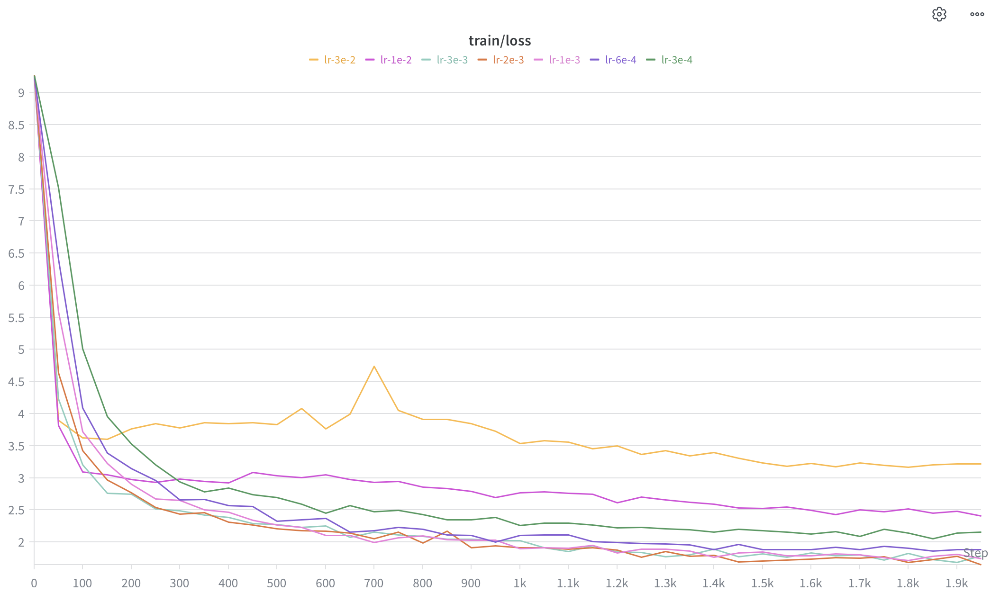
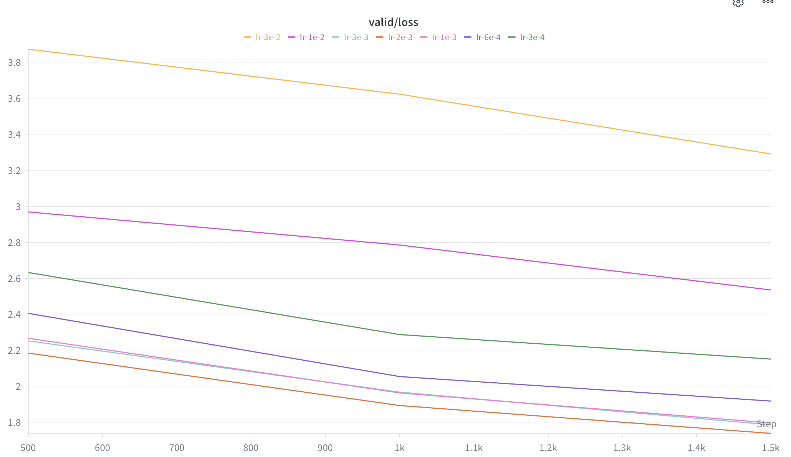
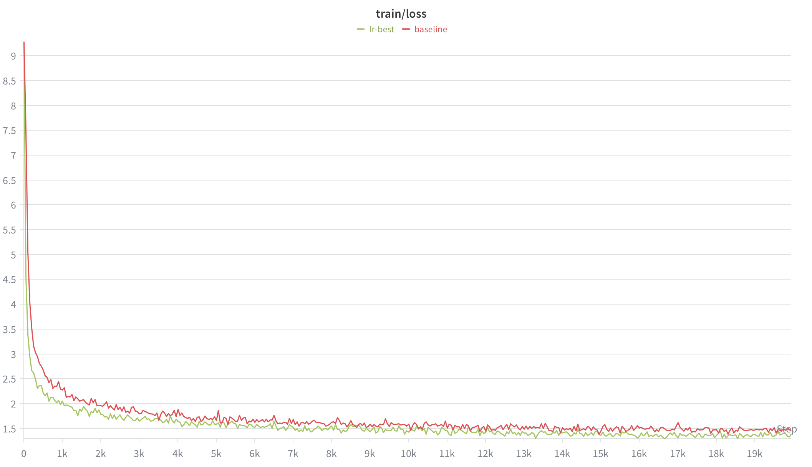
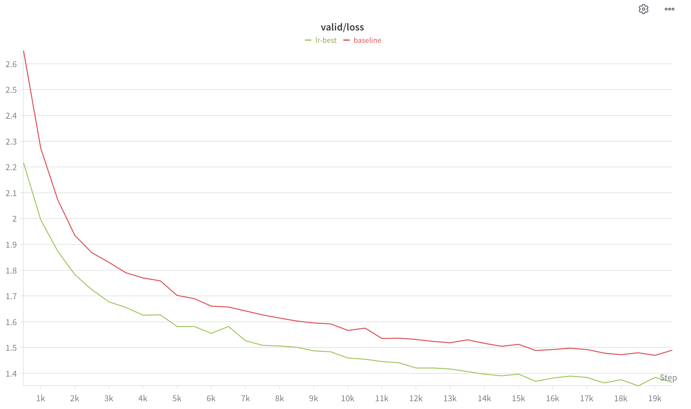
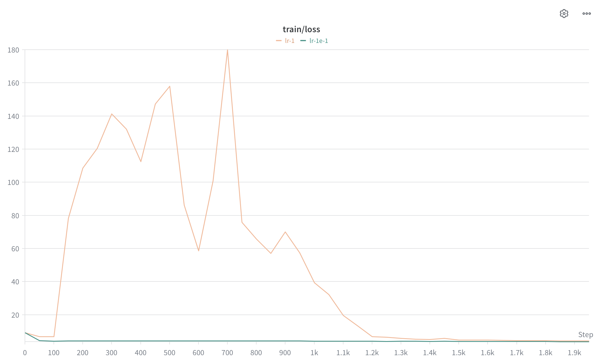
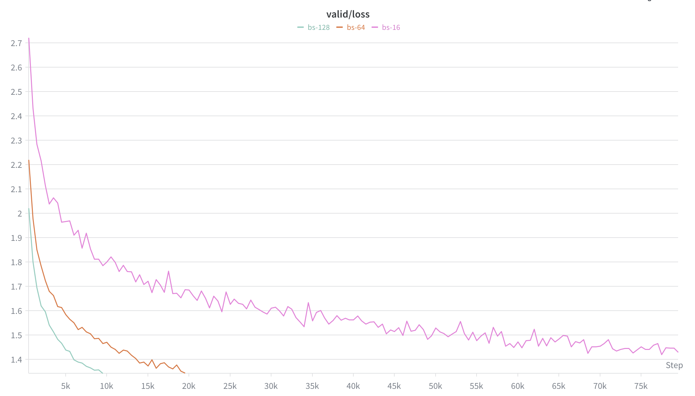
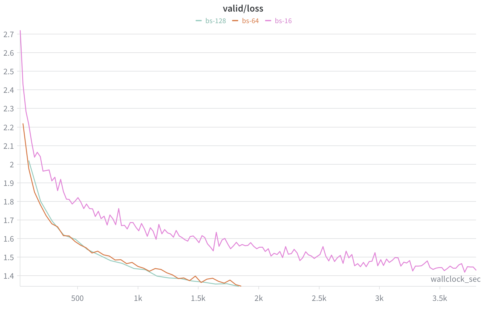

# BPE Training Experiments

## 2026-06-08 — multiprocessing imap pre-tokenize

- **Data**: `data/TinyStoriesV2-GPT4-valid.txt`
- **vocab_size**: 10000
- **special_tokens**: `["<|endoftext|>"]`
- **Implementation**: `multiprocessing.Pool` + `imap` over `doc_generate` generator; worker = `pre_tokenize`
- **Commit**: a158843 (working tree dirty: cs336_basics/train_bpe.py)

### Results
- Initial pairs: 932 distinct
- Target merges: 9743
- **Total elapsed: 40.1s**
  - Count pairs: ~negligible (13110 words)
  - BPE merges loop: ~33s

### Notes
- Well under the 2-minute target.
- No single-process baseline recorded yet — consider running once with the old `_pre_tokenize` for a clean comparison.

---

# 分词器实验（§2.7）

## 2026-06-14 — 压缩率

- **脚本**：`cs336_basics/tokenizer_experiments.py`
- **采样**：蓄水池采样，每个数据集 10 篇文档，seed=42，分隔符 `<|endoftext|>`
- **分词器**：TinyStories（10K 词表）、OpenWebText（32K 词表）

### (a) 各分词器在自身数据集上

| 数据集 | 分词器 | 平均 bytes/token | 最小 | 最大 |
|---|---|---|---|---|
| TinyStories | TinyStories (10K) | 4.150 | 3.725 | 4.451 |
| OpenWebText | OpenWebText (32K) | 4.502 | 4.094 | 5.172 |

**答**：在各自匹配的分词器下，TinyStories 的压缩率约 **4.15 bytes/token**，OpenWebText 约 **4.50 bytes/token**；OWT 更高是因为其词表更大（32K vs 10K），能把更多常见子串合并成单个 token。

### (b) 交叉分词（用错配的分词器）

| 样本 | 分词器 | 平均 bytes/token | 对比自身 |
|---|---|---|---|
| OpenWebText | TinyStories (10K) | 3.306 | 4.502 → 下降约 27% |
| TinyStories | OpenWebText (32K) | 4.061 | 4.150 → 下降约 2% |

**答**：用 TinyStories 分词器编码 OWT 样本时，压缩率从 4.50 降到 **3.31 bytes/token**（变差约 27%），因为 10K 小词表是在简单的儿童故事语料上训练的，缺少 OWT 多样化文本所需的 merge，导致文本被切成更多更短的 token；反向（OWT 分词器编码 TinyStories）只降到 4.06（变差约 2%），因为 32K 大词表已基本覆盖 TinyStories 的简单词汇。这种不对称说明：小而专的词表换到域外文本上会显著退化，而大而泛的词表对简单域几乎无损。

### (c) 吞吐量与 Pile(825GB) 估时

- **方法**：截取连续文本，只对编码计时，吞吐 = 字节数 / 耗时；Pile 估时 = `825 GiB / 吞吐`。
- **环境**：8 物理核 = 8 逻辑核（无超线程）。
- **三种实现**：串行 `encode`；并行 `encode_file`（`find_chunk_boundaries` 在 `<|endoftext|>` 切 8 块 + `Pool.map`，结果回传内存）；并行落盘 `encode_file_to_npy`（同样切块，但 worker 把分片写盘、主进程顺序合并）。

**OpenWebText (32K)，100MB 样本：**

| 实现 | 吞吐 | 耗时 | 加速 | Pile(825GB) 估时 |
|---|---|---|---|---|
| 串行 `encode` | 0.49 MB/s | 207s | 1x | ~20 天 |
| 并行 `encode_file` | 1.26 MB/s | 80s | 2.6x | ~7.6 天 |
| 并行 `encode_file_to_npy` | 1.31 MB/s | 77s | 2.7x | ~7.3 天 |

（单进程吞吐随样本/机器负载在 0.49–0.72 MB/s 间波动；TinyStories 略快于 OWT，因 10K 词表 merge 更少。）

**重训 10K TinyStories 后的并行复测（10MB 样本，8 进程，`encode_file`）：**

| 分词器 | 吞吐 | 耗时 | Pile(825GB) 估时 |
|---|---|---|---|
| OpenWebText (32K) | 1.96 MB/s | 5.14s | ~5.2 天 |
| TinyStories (10K) | 2.20 MB/s | 4.54s | ~4.7 天 |

（本次机器负载更轻，绝对吞吐高于上面的 100MB 表；趋势一致：TinyStories 词表小、merge 少，吞吐更高。）

**答**：单进程吞吐约 **0.5–0.7 MB/s**，外推编码整个 Pile（825GB）约需 **14–20 天**；改用 8 进程并行后提升到约 **1.3 MB/s**，Pile 降到约 **7 天**（约 2.7x）。

> **关于加速上限的修正**：并行只到 ~2.7x，远未达 8 核理论上限。最初猜测"瓶颈是几千万 token id 从 worker pickle 回主进程的串行回传"——经落盘版验证**此猜测错误**：消除回传后加速仅从 2.6x→2.7x。真实瓶颈更可能是 **(1) 只切 8 块=进程数，块大小不均时总耗时被最慢的块拖住（无法负载均衡）；(2) 每个任务都把 32K 词表 pickle 一份给 worker 的启动开销**。进一步优化方向：切更多块（如 64）+ `Pool(initializer=...)` 只发一次词表。
>
> **已采纳 (1)**：`encode_file` / `encode_file_to_npy` 新增 `num_chunks` 参数，与 `num_processes` 解耦，默认切 `num_processes*16` 块（8 进程→128 块）。块远多于进程后，`Pool` 会让 worker 干完一块就动态领下一块，自然负载均衡，不再被最慢的单块拖住；分片更多、单片更小，落盘版主进程合并的峰值内存也更低。保序性不变（边界仍有序、`imap` 仍保序），结果与串行逐位一致。注：`find_chunk_boundaries` 按 `<|endoftext|>` 对齐并去重，实际块数可能略少于 `num_chunks`，只会变少不会错位。
>
> **已采纳 (2)**：用 `Pool(initializer=_init_worker, initargs=(inv_vocab, merge_ranks, special_tokens))` 在每个 worker 启动时只发一次词表，存进进程全局 `_WORKER`；task 随之瘦身成 `(file_path, start, end[, shard, dtype])`，不再携带 32K 词表。词表传输量从「跟块数走」（128 块→128 份）降到「跟进程数走」（8 份），于是 (1) 多切块与省传输不再冲突。已验证与串行逐位一致。
>
> **进度可见**：两个并行方法改用 `pool.imap` + `tqdm`（保序不变），按已完成块数实时显示进度条。
>
> 并行（含落盘版）结果均已验证与串行 `encode` **逐位一致**。

### (d) 编码训练/验证集为 token id 序列

- **工具**：`BPETokenizer.encode_file_to_npy(in_path, out_path, num_processes=8)`。
- **要点**：
  - **低内存**：每个 worker 把自己那段编码成 token id 后**写盘为分片**，主进程按块顺序合并进一个 `np.memmap`，全程不在内存堆积全部 token——这是编码 11GB OWT（数十亿 token，list 版会 OOM）的必要条件。
  - **dtype**：按词表大小自动选；OWT(32K)/TinyStories(10K) 的最大 id < 65536，用 `uint16`（每 token 2 字节）。
  - **顺序正确性**：`find_chunk_boundaries` 给出有序、对齐到 `<|endoftext|>` 的边界，分片按索引顺序合并，结果与整段串行编码逐位相同。
- **用法**：

```python
tok.encode_file_to_npy("data/owt_train.txt",        "results/owt_train_ids.npy")
tok.encode_file_to_npy("data/owt_valid.txt",        "results/owt_valid_ids.npy")
tok.encode_file_to_npy("data/TinyStoriesV2-GPT4-train.txt", "results/ts_train_ids.npy")
tok.encode_file_to_npy("data/TinyStoriesV2-GPT4-valid.txt", "results/ts_valid_ids.npy")
# 训练时按需读取，不必全部载入内存：
ids = np.load("results/owt_train_ids.npy", mmap_mode="r")
```

- **预估耗时**（按 ~1.3 MB/s 并行）：TinyStories train 2.1GB ≈ 27 分钟；OWT train 11GB ≈ 2.4 小时。
- **状态**：编码函数已实现并在样本上验证（与串行一致）；全量数据集落盘**尚未执行**，待跑后补上各 `.npy` 的 token 总数与文件大小。

---

# 训练实验日志（§7.1 experiment_log）

## 日志基础设施

- **脚本**：`cs336_basics/train.py`
- **追踪后端**：Weights & Biases（`--wandb-project` 给定时启用，否则只打印 console）。
- **双横轴**：每次 `wandb.log(...)` 同时携带
  - `step=it`（梯度步数）——wandb 默认横轴
  - `wallclock_sec = time.time() - start_time`（墙钟秒数）——可在面板里把 x 轴切换成它
  这样**同一个 loss 值同时关联「步数」和「时间」两个坐标**，满足题目「track loss curves w.r.t. gradient steps AND wall-clock time」。
- **记录的指标**：
  - `train/loss`（每 `--log-interval` 步）
  - `valid/loss`（每 `--eval-interval` 步，在 `@torch.no_grad()` + `model.eval()` 下跑 `--eval-batches` 个 batch 求平均）
  - `lr`（当前 cosine schedule 学习率）
  - `wallclock_sec`（自训练开始的累计墙钟时间）
- **超参存档**：`wandb.init(config=vars(args))` 一次性记录全部命令行超参，每个 run 的配置可复现。
- **为什么要墙钟时间**：仅看「loss vs 步数」会掩盖每步计算成本的差异。做架构 ablation（如换 attention 实现、改 batch size、改 d_model）时，不同配置每步耗时不同，必须用墙钟时间才能公平比较**真实训练效率**。

### 关键代码位置
- `start_time = time.time()`：循环开始前。
- train 日志块：`wandb.log({"train/loss":..., "lr":..., "wallclock_sec":elapsed}, step=it)`。
- valid 日志块：`wandb.log({"valid/loss":..., "lr":..., "wallclock_sec":elapsed}, step=it)`（块内单独计算 `elapsed`）。

### 运行方式
```bash
uv run python -m cs336_basics.train \
  --train-data results/tinystories/ts_train_ids.npy \
  --valid-data results/tinystories/ts_valid_ids.npy \
  --device cuda --context-length 256 \
  --d-model 512 --num-layers 4 --num-heads 16 --d-ff 1344 \
  --batch-size 64 --max-iters 5000 --lr-max 3e-4 --warmup-iters 200 \
  --eval-interval 200 --log-interval 20 --checkpoint-dir checkpoints \
  --wandb-project cs336-a1 --wandb-run-name ts-baseline
```
- 离线调试：前缀 `WANDB_MODE=offline`，事后 `wandb sync <run目录>` 补传。
- 本地无 wandb：不传 `--wandb-project`，仅 console 打印。

## 实验记录表

> 每做一个 ablation 实验追加一行，并附 wandb 曲线截图（步数版 + 时间版各一张）。

| 日期 | 实验名 | 改动 | 关键超参 | 最终 valid loss | 步数 | 墙钟时间 | 结论 |
|------|--------|------|----------|-----------------|------|----------|------|
| 2026-06-28 | baseline (17M, TinyStories) | 标准配置 | lr=3e-4, d=512, L=4, H=16, ctx=256, bs=64 | 1.490 | 20000 | 1904s (~32min, RTX 5090) | 基准线；lr=3e-4 略偏小，未达 ≤1.45 目标 |

## §7.2.1 学习率 sweep（learning_rate）

**硬件**：RTX 5090 单卡。**探路口径**：每条 2000 步（cosine 衰减终点对齐到 2000），其余同 baseline。
**搜索策略**：先按数量级粗扫 3e-4 → 3e-2，定位谷底区间，再在谷底附近（1e-3~3e-3）细看。

### 探路结果（2000 步）

| LR | valid/loss | train/loss | 墙钟时间 | 状态 |
|----|-----------|-----------|---------|------|
| 3e-4 | 2.152 | 2.158 | 185s | 太小，收敛慢 |
| 6e-4 | 1.919 | 1.879 | 186s | 偏小 |
| 1e-3 | 1.797 | 1.742 | 186s | 良好 |
| **2e-3** | **1.739** | **1.646** | 186s | **谷底，最优** |
| 3e-3 | 1.786 | 1.783 | 186s | 良好 |
| 1e-2 | 2.535 | 2.405 | 186s | 偏大，变差 |
| 3e-2 | 3.289 | 3.218 | 186s | 最差，不稳定（train/loss 出现抖动） |

**观察**：valid loss 随 LR 呈 U 形，谷底在 **2e-3** 附近（1e-3~3e-3 均佳）；LR ≥ 1e-2 后性能急剧变差，3e-2 出现训练不稳定（发散迹象）。

### 决赛（最优 LR 跑满 20000 步）

| run | lr-max | valid/loss | train/loss | 步数 | 墙钟时间 | 结论 |
|-----|--------|-----------|-----------|------|---------|------|
| **lr-best** | **2e-3** | **1.366** | 1.394 | 20000 | 1901s (~31.7min) | **达标 ≤1.45 ✅**，较 baseline(3e-4=1.49)显著更优 |

谷底 LR（2e-3）跑满步数后 valid=1.366，相比 baseline 的 lr=3e-4（1.49）下降约 0.12，验证了"探路找谷底 → 冠军长跑"策略有效。

### 发散区（大 LR，验证 edge of stability）

| run | lr-max | valid/loss | train/loss | 步数 | 状态 |
|-----|--------|-----------|-----------|------|------|
| lr-1e-1 | 1e-1 | 3.923 | 3.726 | 2000 | 严重恶化 |
| lr-1 | 1.0 | 4.984 | 4.223 | 2000 | 最差，明显跨过稳定边界 |

**(b) edge of stability 结论**：loss 随 LR 增大先降后升——最优 LR（2e-3）正位于性能开始恶化/发散的拐点之下方。继续增大（1e-2→3e-2→1e-1→1.0）loss 单调恶化（2.5→3.3→3.9→5.0）。注：因训练带**梯度裁剪(grad-clip=1.0)+AdamW 归一化**，即便 lr=1.0 也未冲到 nan，而是 loss 高位发散——说明训练栈对大 LR 有较强容忍度，需关闭裁剪/更大 LR 才会出现 nan 级爆炸。

### sweep 曲线

7 条 LR probe（2000 步）train/loss：



7 条 LR probe valid/loss：



最优 LR（2e-3）跑满 20000 步 vs baseline（3e-4）：





发散区（lr-1 train/loss 冲到 ~180，lr-1e-1 贴底）：



## §7.2.3 batch size 实验（batch_size_experiment）

**设计**：固定全量 token 预算 327.68M（=batch×iters×256），`max_iters=327.68M/(batch×256)` 反比调整；lr 按 √scaling `2e-3·√(batch/64)`，`lr_min=lr_max/10`。单卡 RTX 5090（32GB）。

| batch | lr_max | max_iters | 状态 | train/loss | valid/loss | wallclock |
|-------|--------|-----------|------|-----------|-----------|-----------|
| 16  | 1.0e-3  | 80000 | 完成 | 1.664* | 1.430 | 3820s |
| 64  | 2.0e-3  | 20000 | 完成 | 1.338 | 1.344 | 1898s |
| 128 | 2.83e-3 | 10000 | 完成 | 1.335 | **1.343** | 1920s |
| 256 | 4.0e-3  | 5000  | OOM | — | — | backward 阶段 OOM |
| 512 | 5.66e-3 | 2500  | OOM | — | — | forward 即 OOM |

\* bs-16 的 train/loss 是末步单个 batch=16 噪声读数，非有效对比量；以 valid 为准。

**结论**：
1. **显存上限 128~256 之间**——128 是最大可跑档，256 在 iter0 backward OOM（激活随 batch 线性增长）。
2. **小 batch 双输**——bs-16 valid 最差（1.430）且 wallclock 近 2 倍（3820s），因 GPU 欠载 + 梯度噪声大。
3. **64/128 是甜点**——valid 几乎相同（1.344/1.343）、墙钟相近（~1900s），固定 token 预算下喂满 GPU 后增大 batch 不再提速但逼近显存上限且不损质量。

### 为什么大 batch 没变快、小 batch 反而变慢（吞吐量机理）

固定 token 预算下 `wallclock = 总token / 吞吐量`，总 token 是常数，所以墙钟完全由吞吐量决定。而单步耗时 `t_step ≈ t_固定开销(与batch无关：kernel启动/调度/同步) + t_计算(∝batch)`，分两个区间：

- **小 batch（欠载区）**：计算量小，GPU 大量核闲置，`t_step ≈ t_固定` 近似常数，不随 batch 缩小而同比缩小 → `吞吐 = batch·ctx / t_固定 ∝ batch`。batch 越小吞吐越低，固定开销被反复白付。**bs-16 就在这个区间 → 3820s，近 2 倍。**
- **大 batch（喂满区）**：GPU 并行单元占满，`t_step ≈ t_计算 ∝ batch` → `吞吐 = batch·ctx /(k·batch) = ctx/k = 常数`（饱和）。batch 翻倍则每步 token 翻倍、每步耗时也翻倍，两者抵消，吞吐封顶。**bs-64→128 落在这段 → 墙钟 1898s≈1920s。**

一句话：**吞吐量在 GPU 喂满后封顶**，故 64→128 没变快；batch 小到 16 时 GPU 欠载、吞吐掉下来，故反而变慢。决定速度的是**硬件利用率**而非 batch 本身。大 batch 真正的加速价值在**分布式数据并行**（切给更多卡），单卡固定预算下喂满即到头。

### sweep 曲线



## §7.3 消融：去除 RMSNorm

对照组复用 `lr_best`（有 norm，valid=1.366）；实验组 `no-rmsnorm` 除 `--no-rmsnorm` 外超参逐字一致（lr=2e-3, batch=64, 20000步）。

| run | norm | lr-max | 初始 loss | 结果 | valid/loss |
|-----|------|--------|-----------|------|-----------|
| lr-best | 有 | 2e-3 | ~9.2 (=ln 10000) | 平稳收敛 | **1.366** |
| no-rmsnorm | 无 | 2e-3 | **19.8** | iter 300 尖峰 → 500 loss 196 → 850 **nan** | 发散 |
| no-rmsnorm-stable | 无 | 1e-4 | ~9.x | 平稳收敛（更慢/更高）| **1.701** |

**发散轨迹**（no-rmsnorm, lr=2e-3, train/loss）：2.72(250) → 28.6(300) → 196(500) → 2.4e12(650) → nan(850)。

**机理**：pre-norm 结构里 RMSNorm 在每个子层入口把输入重缩放到单位 RMS，使残差流的绝对尺度与子层计算解耦、梯度有界。去掉后残差流逐层累加无人拉回 → 激活随深度/步数放大 → 梯度爆炸 → 在 lr=2e-3 下正反馈更新，几百步冲到 inf 再变 nan。初始 loss 19.8（而非 9.2）即未归一化激活尺度已失控的信号。

**结论**：RMSNorm 对深层 Transformer 的**训练稳定性不可或缺**。去掉后不是「不能训」，而是**稳定 lr 上界被大幅压低**：把 lr 从 2e-3 降到 1e-4 才不发散（no-rmsnorm-stable），但代价是收敛更慢、最终 valid **1.701 vs 1.366 明显更差**。即 norm 的价值 = 扩大 lr 稳定裕度 + 提升可达最优。

### 冒烟验证（管线连通性，非正式实验）
- 小配置（d=128, L=2, H=4, d_ff=256, ctx=64, bs=16）CPU 跑 ~60 步：loss 9.22 → 6.08，train/valid loss、lr、wallclock_sec 均正常上报；checkpoint 保存与 `--resume` 续训验证通过。
- 仅证明日志/训练/序列化管线正确，**不作为正式 ablation 结果**。

### 待办
- [x] 在 GPU 上跑 17M baseline 完整训练（RTX 5090，valid=1.49，20000 步，~32min）。
- [x] §7.2.1 learning rate sweep 探路（见上）。
- [x] §7.2.1 决赛（lr=2e-3，valid=1.366，达标）+ (b) 发散区（lr=1e-1/1.0）。
- [x] §7.2.3 batch size 实验（bs=16/64/128 完成，256/512 OOM = 显存上限）。
- [ ] §7.2.3 generate：已用 baseline checkpoint 生成文本。
- [x] §7.3 ablation：RMSNorm 去除（lr=2e-3 直接 nan 发散）。
- [ ] §7.3 剩余 ablation（post-norm、NoPE、SwiGLU→SiLU）。
- [ ] §7.4 OpenWebText（注意 vocab=32000）。
- [ ] 每条实验附 wandb loss 曲线截图（gradient-step 横轴 + wall-clock 横轴）。
